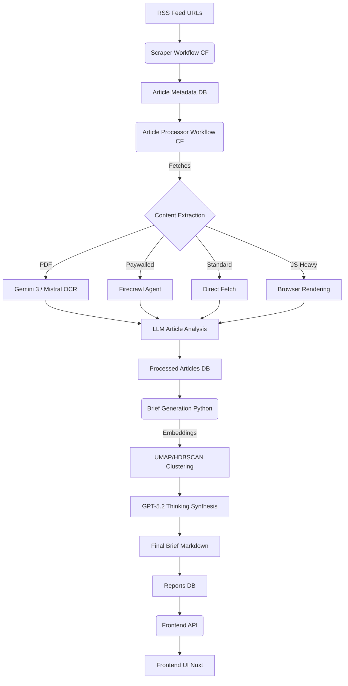

# Meridian: Your Personal Intelligence Agency

[](https://github.com/iliane5/meridian/actions/workflows/deploy-services.yaml)
[](https://opensource.org/licenses/MIT)

**Presidential-level intelligence briefings, built with AI, tailored for you.**

Meridian cuts through news noise by scraping hundreds of sources, analyzing stories with AI, and delivering concise, personalized daily briefs.

<p align="center">
  
</p>

## Why It Exists

Presidents get tailored daily intelligence briefs. Now with AI, you can too. Meridian delivers:

- Key global events filtered by relevance
- Context and underlying drivers
- Analysis of implications
- Open-source transparency

Built for the curious who want depth beyond headlines without the time sink.

## Key Features

- **Source Coverage**: Hundreds of diverse news sources
- **AI Analysis**: Multi-stage LLM processing with Gemini 3 Flash/Pro
- **Smart Clustering**: Embeddings + UMAP + HDBSCAN to group related articles
- **PDF Processing**: Gemini 3 + Mistral OCR 3 for document sources
- **AI Scraping**: Firecrawl Agent for paywalled sites
- **Personalized Briefing**: Daily brief with analytical voice and continuity tracking
- **Admin Dashboard**: Beautiful real-time stats at `/admin`
- **Web Interface**: Clean Nuxt 3 frontend

## Project Structure

```
meridian/
├── .github/
│   └── workflows/
│       └── deploy-services.yaml       # CI/CD pipeline
├── .vscode/
│   ├── extensions.json
│   └── settings.json
├── apps/
│   ├── briefs/                        # Python briefing generation
│   │   ├── src/
│   │   │   ├── events.py              # API client for events
│   │   │   └── llm.py                 # Multi-model LLM (GPT-5.2, Gemini 3)
│   │   ├── reportV5.ipynb             # Jupyter notebook
│   │   └── reportV5.md
│   │
│   ├── frontend/                      # Nuxt 3 web application
│   │   ├── src/
│   │   │   ├── assets/css/main.css
│   │   │   ├── composables/
│   │   │   │   ├── useSEO.ts
│   │   │   │   └── useReports.ts
│   │   │   ├── pages/
│   │   │   │   ├── index.vue
│   │   │   │   ├── admin/index.vue    # Admin dashboard
│   │   │   │   └── briefs/
│   │   │   │       ├── index.vue
│   │   │   │       ├── latest.vue
│   │   │   │       └── [slug].vue
│   │   │   ├── plugins/markdown.ts
│   │   │   ├── public/                # Favicons, manifest
│   │   │   └── server/api/
│   │   │       ├── reports.get.ts
│   │   │       ├── stats.get.ts       # Dashboard stats
│   │   │       └── subscribe.post.ts
│   │   ├── nuxt.config.ts
│   │   ├── tsconfig.json
│   │   └── package.json
│   │
│   └── scrapers/                      # Cloudflare Workers
│       ├── src/
│       │   ├── index.ts               # Main worker entry
│       │   ├── app.ts                 # Hono app setup
│       │   ├── lib/
│       │   │   ├── models.ts          # AI model configuration
│       │   │   ├── firecrawl.ts       # Firecrawl Agent integration
│       │   │   ├── documentOcr.ts     # Gemini 3 + Mistral OCR
│       │   │   ├── puppeteer.ts       # Browser rendering
│       │   │   ├── rateLimiter.ts     # Rate limiting
│       │   │   ├── parsers.ts         # RSS parsing
│       │   │   └── utils.ts
│       │   ├── prompts/
│       │   │   └── articleAnalysis.prompt.ts
│       │   ├── routers/
│       │   │   ├── reports.router.ts
│       │   │   └── openGraph.router.ts
│       │   └── workflows/
│       │       ├── rssFeed.workflow.ts
│       │       └── processArticles.workflow.ts
│       ├── test/
│       │   ├── parseRss.spec.ts
│       │   └── fixtures/              # RSS feed samples
│       ├── wrangler.toml              # Workers config
│       ├── tsconfig.json
│       └── package.json
│
├── packages/
│   ├── database/                      # Drizzle ORM
│   │   ├── src/
│   │   │   ├── index.ts
│   │   │   ├── database.ts
│   │   │   └── schema.ts              # Table definitions
│   │   ├── migrations/                # SQL migrations
│   │   ├── drizzle.config.ts
│   │   └── package.json
│   │
│   └── typescript-config/             # Shared TS config
│       ├── base.json
│       └── package.json
│
├── .nvmrc                             # Node 22.14.0
├── .prettierrc                        # Code formatting
├── CLAUDE.md                          # AI assistant guide
├── LICENSE
├── README.md
├── package.json                       # Root monorepo config
├── pnpm-workspace.yaml
└── turbo.json                         # Turborepo config
```

## How It Works



## Tech Stack (December 2025)

| Layer | Technology |
|-------|------------|
| **Monorepo** | Turborepo 2.4+ / pnpm 9.15+ |
| **Runtime** | Node.js 22.14 LTS |
| **Infrastructure** | Cloudflare Workers, Workflows, Pages |
| **Backend** | Hono 4.11+, TypeScript 5.8 |
| **Database** | PostgreSQL + Drizzle ORM 0.45+ |
| **Frontend** | Nuxt 4.2+, Vue 3.5+, Tailwind CSS 4.0+ |
| **AI Models** | Gemini 3 Flash/Pro, GPT-5.2, Mistral OCR 3 |
| **AI Scraping** | Firecrawl Agent |
| **ML Pipeline** | Python: UMAP, HDBSCAN, multilingual-e5-small |

### AI Models Used

| Component | Model | Purpose |
|-----------|-------|---------|
| Article Analysis | Gemini 3 Flash | Fast classification with thinking levels |
| Brief Synthesis | GPT-5.2 Thinking | 80% fewer hallucinations, best reasoning |
| Document OCR | Gemini 3 Flash / Mistral OCR 3 | PDF processing |
| Complex Scraping | Firecrawl Agent | AI-powered navigation |

## Setup

**Prerequisites**: Node.js v22+, pnpm v9.15+, Python 3.10+, PostgreSQL, Cloudflare account

```bash
git clone https://github.com/iliane5/meridian.git
cd meridian
pnpm install

# Configure environment files
cp apps/scrapers/.dev.vars.local apps/scrapers/.dev.vars
cp packages/database/.env.example packages/database/.env

# Run database migrations
pnpm --filter @meridian/database db:migrate

# Development
pnpm dev
```

### Environment Variables

```bash
# Required
DATABASE_URL=              # PostgreSQL connection
GOOGLE_API_KEY=            # Gemini 3 API key
GOOGLE_BASE_URL=           # Google AI base URL
MERIDIAN_SECRET_KEY=       # API authentication

# Optional (enable advanced features)
OPENAI_API_KEY=            # GPT-5.2 for briefs
MISTRAL_API_KEY=           # Mistral OCR 3 for PDFs
FIRECRAWL_API_KEY=         # AI scraping for complex sites
ANTHROPIC_API_KEY=         # Claude 4.5 fallback
```

## Development Commands

```bash
pnpm dev                   # Run all apps
pnpm build                 # Build all packages
pnpm typecheck             # Type checking
pnpm format                # Prettier formatting
pnpm --filter @meridian/scrapers test  # Run tests
```

## Status & Next Steps

- ✅ **Core Pipeline**: Scraping, processing, analysis working
- ✅ **AI Models**: Upgraded to Gemini 3, GPT-5.2, Mistral OCR 3
- ✅ **Admin Dashboard**: Real-time stats at `/admin`
- ⏳ **Top Priority**: Automate brief generation
- 🔜 **Future**: Newsletter distribution, more testing

## AI Collaboration

This project benefited significantly from AI assistance:

- **Claude Opus 4.5**: Architecture design, code review, documentation
- **Gemini 3 Pro**: Long-context analysis, brief synthesis
- **Gemini 3 Flash**: High-volume article processing (the workhorse)
- **GPT-5.2 Thinking**: Deep cluster analysis with minimal hallucinations

## License

MIT License - See [LICENSE](./LICENSE) file for details.

---

_Built because we live in an age of magic, and we keep forgetting to use it._
